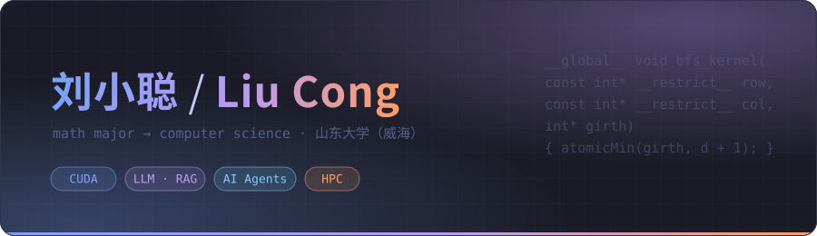
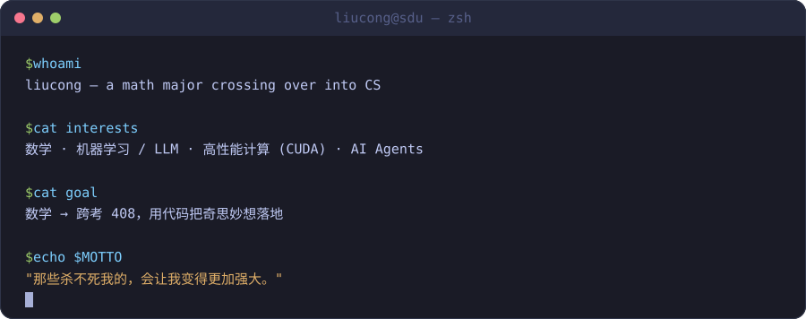
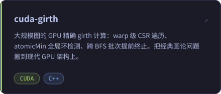
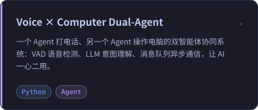
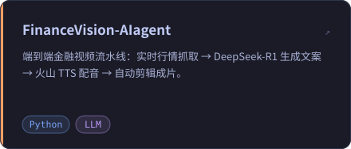
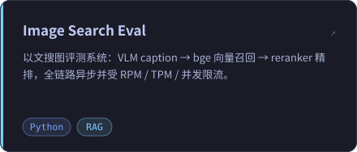
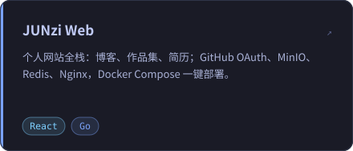
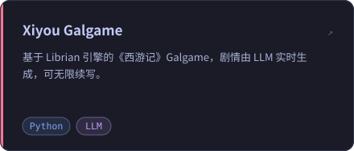
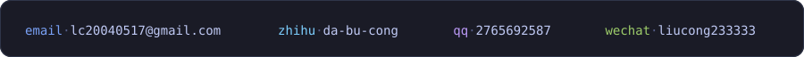

 

  

 

 
 
 

 

 

 

  

<picture>
  <source media="(prefers-color-scheme: dark)" srcset="https://raw.githubusercontent.com/Liucong-JunZi/Liucong-JunZi/output/github-contribution-grid-snake-dark.svg" />
  <source media="(prefers-color-scheme: light)" srcset="https://raw.githubusercontent.com/Liucong-JunZi/Liucong-JunZi/output/github-contribution-grid-snake.svg" />
  
</picture>

 

 

  

Was mich nicht umbringt, macht mich stärker. — Nietzsche

